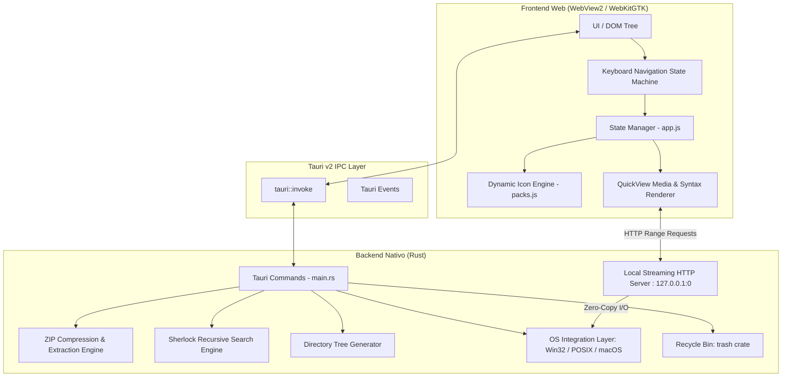

# Arquitectura y Funcionamiento Interno de tronExplorer

**tronExplorer** es un explorador de archivos de alto rendimiento, ligero y multiplataforma inspirado en la elegancia visual de **GNOME Files (Nautilus) / Adwaita** y la inmediatez funcional del **Quick Look** de macOS y **Sushi** de GNOME.

Este documento proporciona una guía exhaustiva de la arquitectura del sistema, el diseño del backend en Rust, los protocolos IPC (Inter-Process Communication), el servidor de streaming local, el motor frontend en Vanilla JavaScript/Tailwind CSS y las abstracciones multiplataforma para Windows, Linux y macOS.

---

## 1. Visión General y Filosofía de Diseño



### Principios Fundamentales:
1. **Zero-Bloat y Rendimiento Nativo**: El núcleo de acceso a disco, cálculo de tamaños, compresión y búsqueda se ejecuta compilado en código máquina nativo (Rust). No hay sobrecarga de Node.js, Electron ni frameworks pesados en el frontend.
2. **Privacidad Total (Zero Telemetry)**: Todas las operaciones, consultas y lecturas se realizan estrictamente de forma local. No existen llamadas a APIs remotas ni envío de métricas.
3. **No Bloqueo de la Interfaz (Async & Multithreading)**: Las tareas intensivas en disco (búsqueda recursiva en Sherlock, compresión ZIP, cálculo de tamaños de directorios, generación de listados) se ejecutan de manera asíncrona o en hilos de trabajo independientes para mantener 60+ FPS constantes en la interfaz gráfica.
4. **Streaming Eficiente en Memoria**: Para archivos de vídeo o audio pesados (múltiples gigabytes), un servidor HTTP interno en un puerto efímero sirve las peticiones con cabeceras `Range: bytes=start-end`, permitiendo reproducción instantánea sin cargar el archivo completo en memoria RAM.

---

## 2. Estructura del Proyecto

```
tron/
├── .github/
│   └── workflows/
│       └── build.yml              # CI/CD multiplataforma (Windows, Ubuntu, macOS)
├── docs/
│   └── ARCHITECTURE.md            # Este documento de arquitectura técnica
├── scripts/
│   ├── build-windows.ps1          # Script de compilación automática MSVC para Windows
│   └── build-arch.sh              # Script de compilación e instalación para Arch Linux
├── src-tauri/
│   ├── src/
│   │   └── main.rs                # Backend principal: Comandos IPC, HTTP Server, Win32/POSIX
│   ├── icons/                     # Iconografía de empaquetado (.ico, .png)
│   ├── Cargo.toml                 # Dependencias y perfiles de compilación Rust
│   └── tauri.conf.json            # Configuración de ventana, plugins y empaquetado Tauri
├── ui/
│   ├── index.html                 # Estructura del DOM, diálogos modales y contenedores
│   ├── app.js                     # Controlador principal de la UI, eventos y estado
│   ├── packs.js                   # Definiciones SVG vectoriales de los 6 packs de iconos
│   └── tailwind.css               # Estilos base y temas visuales
├── icon.ico                       # Icono de la aplicación en raíz
├── Tron.exe                       # Ejecutable portable precompilado para Windows x64
└── README.md                      # Documentación de usuario y guía de inicio rápido
```

---

## 3. Backend en Rust (`src-tauri/src/main.rs`)

El backend está desarrollado sobre **Tauri v2** utilizando Rust 2021. Actúa como el puente entre el sistema operativo y el frontend web.

### 3.1. Hook de Pánicos y Tolerancia a Fallos
El método `main()` inicializa un hook global de pánico:
```rust
std::panic::set_hook(Box::new(|info| {
    let msg = format!("PANIC: {:?}\n", info);
    eprintln!("{}", msg);
    let _ = std::fs::write("tron_crash.log", msg);
}));
```
Cualquier fallo no capturado se escribe inmediatamente en `tron_crash.log` en el directorio de ejecución, evitando que el proceso muera silenciosamente y facilitando la depuración en entornos de producción.

### 3.2. Servidor HTTP de Streaming Local
Para evitar las limitaciones de transferencia de base64 o bloqueos del hilo IPC al previsualizar medios en QuickView, la aplicación inicia un servidor HTTP embebido:
- **Enlace efímero**: `TcpListener::bind("127.0.0.1:0")`. El sistema operativo asigna automáticamente un puerto TCP no utilizado.
- **Soporte de Cabeceras Range**: Implementa análisis de `Range: bytes=inicio-fin`. Esto permite que elementos `<video>` y `<audio>` del WebView realicen saltos temporales (scrubbing) instantáneos con transferencias parciales (código HTTP 206 Partial Content).
- **Seguridad**: Se verifican las rutas absolutas para evitar ataques de salto de directorio (Path Traversal) y solo se atienden conexiones originadas desde `127.0.0.1`.

### 3.3. Motor de Búsqueda Sherlock (`sherlock_search`)
El motor de búsqueda avanzada de Tron permite indexar y filtrar el sistema de archivos de forma ultrarrápida:
- **Presets Integrados**:
  - *Últimas 24 horas*: Filtra archivos cuya fecha de modificación sea `>= now - 86400s`.
  - *Top 25 Archivos Pesados*: Mantiene una lista acotada de los 25 archivos de mayor peso en la jerarquía.
  - *Top 25 Carpetas Pesadas*: Calcula recursivamente el tamaño de los subdirectorios y ordena de mayor a menor.
- **Filtros Multicriterio**: Admite combinación de patrones de texto (insensible a mayúsculas), rangos de tamaño (Bytes, KB, MB, GB), rangos de fechas (desde/hasta) y alcance (carpeta actual o raíz del sistema).

### 3.4. Compresión y Descompresión ZIP (`zip` crate)
- **Compresión (`compress_to_zip`)**: Emplea el algoritmo Deflate optimizado. Recorre recursivamente las selecciones (archivos o carpetas completos), preserva la estructura relativa de rutas y genera un archivo `.zip` estándar.
- **Descompresión Segura (`extract_zip_archive`)**: Sanitiza cada entrada del archivo comprimido comprobando que la ruta resultante no escape del directorio destino (prevención estricta de vulnerabilidades **Zip Slip**).
- **Inspección sin Extracción (`list_zip_contents`)**: Lee el directorio central del ZIP sin extraer los datos al disco, devolviendo la lista estructurada con tamaños comprimidos/reales y fechas para la visualización en modal.

### 3.5. Generador de Listados y Árboles (`generate_directory_listing`)
Permite exportar a un fichero `.txt` el inventario completo de un directorio:
- **Modo Árbol Jerárquico**: Dibuja conectores visuales ASCII/Unicode (`├──`, `└──`, `│   `).
- **Control de Profundidad**: Parámetro `max_depth` (por defecto 2 o sin límite).
- **Filtro de Archivos**: Opción para listar únicamente carpetas o incluir ficheros.
- **Metadatos Opcionales**: Genera columnas alineadas con fecha de modificación y tamaño formateado (KB, MB, GB).

### 3.6. Integraciones con el Sistema Operativo
- **Lugares de Usuario (`get_user_places`)**:
  - *Windows*: Resuelve carpetas mediante API de Known Folders y variables de entorno de perfil (`USERPROFILE`, `Downloads`, `Documents`, `Desktop`, `Pictures`, `Videos`, `Music`).
  - *Linux*: Detecta directorios estándar XDG (`~/.config/user-dirs.dirs`).
  - *macOS*: Mapea rutas bajo `/Users/<usuario>/`.
- **Detección de Unidades (`get_system_drives`)**:
  - *Windows*: Llamada a `GetLogicalDriveStringsW` de Win32 para listar `C:\`, `D:\`, etc.
  - *Linux / macOS*: Mapea puntos de montaje desde `/proc/mounts`, `/media`, `/run/media` y `/Volumes`.
- **Papelera del Sistema (`delete_file_item`)**:
  - Emplea el crate `trash` para interactuar con la Papelera de Reciclaje de Windows (`IFileOperation`), FreeDesktop Trash en Linux y Mac Trash en macOS. Las eliminaciones son 100% recuperables.
- **Explorador y Propiedades del SO**:
  - *Windows*: `ShellExecuteW` con argumentos `/select,<path>` para `explorer.exe` y `SHObjectProperties` para abrir la ventana de propiedades nativa.
  - *Linux*: `dbus` / `xdg-open` y llamada al gestor de archivos predeterminado.
  - *macOS*: `open -R <path>` para revelar en Finder.
- **Lanzador de Terminales y Editores**:
  - Soporta terminales configurables: PowerShell, CMD, Windows Terminal (`wt`), Kitty, Alacritty, Ghostty, Foot, WezTerm, Konsole, GNOME Terminal.
  - Soporta editores: VS Code (`code`), Sublime Text (`subl`), Notepad++, Notepad, Gedit, Nano, Vim, Neovim.

---

## 4. Referencia de Comandos IPC (Tauri)

A continuación se detallan los 26 comandos Tauri invocables desde el frontend mediante `invoke(cmd, args)`:

| Comando | Argumentos | Retorno | Descripción |
| :--- | :--- | :--- | :--- |
| `get_user_places` | - | `Vec<UserPlace>` | Rutas absolutas a Descargas, Documentos, Escritorio, etc. |
| `get_system_drives` | - | `Vec<DriveInfo>` | Lista de unidades de disco detectadas en el sistema. |
| `read_directory` | `path: String, show_hidden: bool` | `DirectoryContent` | Archivos y carpetas del directorio con metadatos. |
| `read_file_preview` | `path: String` | `FilePreview` | Metadatos, contenido de texto (hasta 5MB) o URL de streaming. |
| `delete_file_item` | `path: String` | `Result<(), String>` | Envía el archivo o carpeta a la Papelera de reciclaje. |
| `open_file_default` | `path: String` | `Result<(), String>` | Abre el elemento con el programa predeterminado del SO. |
| `create_new_file` | `directory: String, file_name: String` | `Result<String, String>` | Crea un nuevo archivo en blanco en el directorio. |
| `create_new_directory` | `directory: String, folder_name: String` | `Result<String, String>` | Crea una nueva carpeta en el directorio. |
| `rename_file_or_folder`| `old_path: String, new_name: String` | `Result<String, String>` | Renombra un elemento controlando colisiones. |
| `copy_items` | `sources: Vec<String>, dest_dir: String` | `Result<(), String>` | Copia archivos/carpetas con sufijo `(copia X)` anticolición. |
| `move_items` | `sources: Vec<String>, dest_dir: String` | `Result<(), String>` | Mueve archivos/carpetas entre directorios. |
| `get_directory_size` | `path: String` | `DirectorySizeInfo` | Calcula recursivamente el tamaño en bytes y número de ítems. |
| `search_directory_recursive` | `dir: String, query: String` | `Vec<FileItem>` | Búsqueda por subcadena en nombres dentro de la jerarquía. |
| `sherlock_search` | `options: SherlockOptions` | `Vec<FileItem>` | Búsqueda avanzada multicriterio (fechas, tamaño, presets). |
| `force_exit_app` | - | - | Cierra inmediatamente el proceso de forma limpia. |
| `open_terminal` | `directory: String, terminal_app: Option<String>` | `Result<(), String>` | Abre la terminal configurada en la ruta indicada. |
| `open_in_editor` | `path: String, editor_app: Option<String>` | `Result<(), String>` | Abre el archivo en el editor de código/texto elegido. |
| `get_app_info` | - | `AppInfo` | Versión, plataforma, arquitectura y detalles del SO. |
| `show_in_system_explorer` | `path: String` | `Result<(), String>` | Resalta el archivo en Windows Explorer / Finder / Linux. |
| `show_item_properties`| `path: String` | `Result<(), String>` | Despliega la ventana nativa de propiedades del sistema. |
| `open_with_dialog` | `path: String` | `Result<(), String>` | Abre el diálogo nativo "Abrir con..." del sistema operativo. |
| `launch_with_app` | `path: String, app_path: String` | `Result<(), String>` | Ejecuta el archivo con una aplicación específica o binario. |
| `compress_to_zip` | `items: Vec<String>, dest_zip: String` | `Result<(), String>` | Comprime los elementos seleccionados en un archivo `.zip`. |
| `extract_zip_archive`| `zip_path: String, dest_dir: String` | `Result<(), String>` | Descomprime el archivo `.zip` con validación de seguridad. |
| `generate_directory_listing` | `options: ListingOptions` | `ListingResult` | Genera árbol o listado en fichero `.txt`. |
| `get_disk_free_space` | `path: Option<String>` | `Result<DiskSpaceInfo, String>` | Devuelve el espacio libre y total de la unidad o volumen. |
| `search_subfolders` | `base_path: String, query: String, max_depth: Option<usize>` | `Result<Vec<FolderJumpItem>, String>` | Búsqueda recursiva multihilo de carpetas para salto rápido (`Ctrl+P`). |
| `read_file_hex` | `path: String` | `Result<String, String>` | Genera volcado hexadecimal con offset y representación ASCII (`H` en QuickView). |
| `batch_rename` | `items: Vec<String>, pattern: String, replace: String, prefix: String, suffix: String, sequence: Option<SequenceConfig>` | `Result<usize, String>` | Renombrado en masa con secuencias y patrones numéricos. |

---

## 5. Frontend Web (`ui/`)

El frontend está implementado en **Vanilla JavaScript** y estilizado con **Tailwind CSS**, priorizando cero dependencias, carga instantánea y máximo control del ciclo de vida del DOM.

### 5.1. Gestión de Estado Centralizada (`state`)
En `ui/app.js`, el estado de la aplicación reside en un objeto único reactivo:
```javascript
const state = {
  currentDirectory: '',
  items: [],              // Elementos del directorio actual
  filteredItems: [],      // Elementos tras aplicar búsqueda/filtro
  selectedItems: new Set(),// Conjunto de rutas seleccionadas
  selectedIndex: -1,      // Elemento activo en foco
  selectionAnchor: -1,    // Ancla para selección por rangos (Shift + Clic/Flechas)
  history: [],            // Pila de navegación hacia atrás
  historyIndex: -1,       // Índice actual en el historial
  sortColumn: 'name',     // 'name' | 'size' | 'modified' | 'ext'
  sortAscending: true,
  clipboard: { items: [], action: null }, // 'copy' | 'cut'
  theme: 'adwaita',
  iconPack: 'default',
  density: 'normal',      // 'compact' | 'normal' | 'spacious'
  fontSize: 14,
  showHiddenFiles: false,
  quickViewOpen: false,
  favorites: []
};
```

### 5.2. Pestañas de Navegación y Modelo de Paneles
La aplicación soporta un modelo jerárquico de paneles y pestañas (`panels[activePanel].tabs[activeTab]`):
- **Aislamiento Total**: Cada pestaña preserva de forma independiente su ruta actual, historial de navegación hacia adelante/atrás, selección activa, término de búsqueda y subcarpetas desplegadas.
- **Rendimiento Óptimo**: Solo la pestaña visible mantiene elementos montados en el DOM; cambiar de pestaña es instantáneo y no satura la memoria.
- **Atajos Integrados**: `Ctrl + T` (nueva pestaña), `Ctrl + W` (cerrar pestaña), `Ctrl + 1..9` (saltar a pestaña directa), y clic central para cerrar.

### 5.3. Sistema de Etiquetas por Colores y Metadatos (Finder / Dolphin)
- **Persistencia Ligera en LocalStorage**: Mapea rutas normalizadas (`{ [path]: ['red', 'blue'] }`) sin alterar atributos extendidos del sistema de archivos, garantizando compatibilidad total con NTFS, ext4, Btrfs, APFS, FAT32 y unidades de red compartidas (UNC).
- **Indicadores en Tiempo Real**: Inyecta puntos de color SVG/CSS en el listado junto al nombre del fichero.
- **Filtrado Reactivo**: El panel lateral calcula contadores en vivo para los 7 colores (`red`, `orange`, `yellow`, `green`, `blue`, `purple`, `gray`) y permite filtrar la vista del directorio con un solo clic.

### 5.4. Vista en Árbol Plegable en el Listado
- **Estructura Dinámica In-Place**: En la vista de lista detallada, las carpetas disponen de un botón interactivo (`▶` / `▼`).
- **Inyección Aplanada con Sangría Proporcional**: Al hacer clic en la flecha, el frontend consulta `read_directory` para esa subcarpeta específica y almacena los resultados en `state.expandedDirs`. El renderizador aplana la jerarquía inyectando los elementos hijos con desplazamiento visual `(depth * 18px)` sin alterar la ruta base de trabajo.

### 5.5. Máquina de Estados de Navegación por Teclado
El controlador `handleGlobalKeyDown` intercepta y gestiona los eventos de teclado de manera inteligente:
1. **Trampa de Modales y Campos de Texto**: Si el foco se encuentra en un `<input>` o `<textarea>`, las teclas alfanuméricas escriben normalmente y `Enter`/`Escape` confirman o cancelan el modal actual.
2. **Salto Rápido a Carpeta (`Ctrl + P`)**: Abre el buscador difuso recursivo para escanear y saltar a cualquier subdirectorio hasta 5 niveles de profundidad de forma asíncrona.
3. **Pestañas de Navegación (`Ctrl + T` / `Ctrl + W` / `Ctrl + 1..9`)**: Gestión de pestañas sin levantar las manos del teclado.
4. **Terminal Dedicada (`Ctrl + Shift + T`)**: Lanza la terminal configurada en la ruta de trabajo actual.
5. **Panel Dual Dividido (`F3` / `Ctrl + \`)**: Conmuta entre vista simple y panel dual, permitiendo copiar archivos entre paneles con `F5` y alternar el foco con `Tab`.
6. **Selección por Rango Continuo (`Shift + Flechas`)**: Calcula el rango comprendido entre `selectionAnchor` y el nuevo índice, seleccionando todos los elementos intermedios como en los exploradores de escritorio nativos.
7. **Navegación Alfanumérica Instantánea (Type-Ahead)**: Al presionar cualquier letra o número (`A-Z`, `0-9`), el cursor salta cíclicamente al siguiente archivo o carpeta cuyo nombre comience por dicho carácter.
8. **Modo QuickView Activo**: El espacio o escape cierran el visor, `H` genera volcado hexadecimal en tiempo real, las flechas navegan por los archivos del directorio cargando la nueva vista previa al instante y `Delete` envía el archivo a la papelera avanzando automáticamente al siguiente sin cerrar el visor.

### 5.6. Sistema de Iconografía Dinámica Multi-Pack (`ui/packs.js`)
El motor de iconos desacopla completamente el diseño visual de la lógica del explorador:
- **6 Packs Integrados**:
  1. `default`: Emojis modernos de alta legibilidad.
  2. `yaru`: Conjunto vectorial SVG oficial de Ubuntu Yaru.
  3. `win10`: Iconos vectoriales Fluent inspirados en Windows 10/11.
  4. `macos`: Iconos vectoriales con la estética de macOS Big Sur.
  5. `slot-dark`: Pack minimalista de alto contraste oscuro.
  6. `slot-light`: Pack minimalista de alto contraste claro.
- **Resolución Inteligente de Tipos**: Detecta extensiones específicas y asigna iconos dedicados para documentos (PDF, Word, Excel, PowerPoint), código fuente (Rust, JS, Python, HTML, CSS, C++, Go), medios (imágenes, audios, vídeos), comprimidos (ZIP, TAR, GZ, 7Z, RAR) y ejecutables.
- **Sincronización Total**: Al cambiar de pack en Preferencias, se actualizan simultáneamente los iconos de la lista de archivos, la barra de herramientas superior y el panel lateral de navegación.
- **Escalado por Densidad**:
  - *Compacto*: Iconos de 20px, filas de 24px.
  - *Normal*: Iconos de 28px, filas de 32px.
  - *Espacioso*: Iconos de 40px, filas de 44px.

### 5.7. Motor de Temas Visuales (14 Temas Claro/Oscuro)
El sistema implementa 7 temas oscuros y sus 7 contrapartes claras mediante variables CSS nativas:
- **Temas**: Adwaita, Windows 10, Ubuntu, Manjaro, NvChad, TokyoNight, MatteBlack (+ versiones `-light`).
- **Variables dinámicas**:
  ```css
  :root {
    --gnome-bg: #242424;
    --gnome-surface: #303030;
    --gnome-surfaceHover: #383838;
    --gnome-border: #404040;
    --gnome-text: #f6f6f6;
    --gnome-textDim: #a8a8a8;
    --gnome-active: #3584e4;
  }
  ```
- **Escalado Tipográfico en Tiempo Real**: Un control deslizante en Preferencias permite ajustar la fuente global de la aplicación entre 12px y 20px, recalculando las proporciones de texto sin desajustar el diseño.

### 5.8. Arquitectura de QuickView (`Space`)
Al presionar la barra espaciadora sobre un elemento seleccionado, se activa el contenedor modal flotante:
- **Detección de Formato**:
  - *Imágenes*: Renderizadas a través del visor optimizado con zoom y auto-escalado.
  - *Documentos PDF*: Carga el visor nativo del motor de renderizado.
  - *Archivos de Texto / Código*: Consulta el comando `read_file_preview` (con límite de seguridad de 5 MB) e inyecta el código en un contenedor monoespaciado con recuento de líneas.
  - *Audio y Vídeo*: Conecta directamente con la URL efímera del servidor HTTP de streaming local (`http://127.0.0.1:<puerto>/stream?path=...`).
  - *Directorios*: Invoca `get_directory_size` de forma asíncrona, mostrando en tiempo real el tamaño total ocupado y el desglose de elementos contenidos.
- **Acciones Rápidas Integradas**:
  - Botón **Abrir con programa predeterminado**.
  - Botón **Abrir en editor de texto configurado**.
  - Atajo `DEL`: Mueve a la papelera y pasa automáticamente al elemento continuo.

---

## 6. Consideraciones Multiplataforma

| Componente | Windows (x64) | Linux (x64 / Arch / Debian) | macOS (Apple Silicon / Intel) |
| :--- | :--- | :--- | :--- |
| **Motor Web** | Microsoft WebView2 | WebKitGTK 4.1 | Apple WebKit (WKWebView) |
| **Apertura de Archivos** | `ShellExecuteW` | `xdg-open` / `gio open` | `open` |
| **Revelar en Gestor** | `explorer.exe /select,"path"` | D-Bus / `xdg-open` | `open -R "path"` |
| **Propiedades** | `SHObjectProperties` nativo | Diálogo de información | Diálogo de información |
| **Papelera** | Win32 `IFileOperation` | FreeDesktop Trash Spec (`~/.local/share/Trash`) | macOS Trash API |
| **Unidades de Disco** | Letras de unidad (`C:\`, `D:\`) | `/`, `/mnt`, `/media`, `/run/media` | `/`, `/Volumes` |
| **Distribución** | `.exe` portable / instalador | `.deb`, `AppImage`, binario nativo Arch | `.app`, `.dmg` |

---

## 7. Compilación, Empaquetado y CI/CD

El repositorio incluye automatización completa para la integración y entrega continua (CI/CD) a través de **GitHub Actions** (`.github/workflows/build.yml`):
- **Triggers**: Se compila automáticamente en cada `push` a las ramas `main` o `master`, o mediante ejecución manual (`workflow_dispatch`).
- **Matriz de Plataformas**: Compilación paralela en `windows-latest`, `ubuntu-22.04` y `macos-latest`.
- **Artefactos Generados**:
  - Paquetes `.deb` y `.AppImage` para Linux Debian/Ubuntu.
  - Binarios optimizados con LTO (`Link-Time Optimization`), nivel de optimización `opt-level = "z"` y eliminación de símbolos de depuración (`strip = true`).
